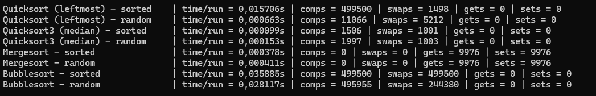

<table class="table table-bordered">
  <tr>
    <th></th>
    <th colspan="2">Quicksort</th>
    <th colspan="2">Quicksort3</th>
    <th colspan="2">Mergesort</th>
    <th colspan="2">Bubblesort</th>
  </tr>
  <tr>
    <th></th>
    <td>gesorteerd</td>
    <td>geshuffled</td>
    <td>gesorteerd</td>
    <td>geshuffled</td>
    <td>gesorteerd</td>
    <td>geshuffled</td>
    <td>gesorteerd</td>
    <td>geshuffled</td>
  </tr>
  <tr>
    <th>Aantal vergelijkingen</th>
    <td>499 500  <!-- Vergelijkingen Quicksort gesorteerd --></td>
    <td>11 066  <!-- Vergelijkingen Quicksort geshuffled --></td>
    <td>1506  <!-- Vergelijkingen Quicksort3 gesorteerd --></td>
    <td>1997  <!-- Vergelijkingen Quicksort3 geshuffled --></td>
    <td>0  <!-- Vergelijkingen Mergesort gesorteerd --></td>
    <td>0  <!-- Vergelijkingen Mergesort geshuffled --></td>
    <td>499500  <!-- Vergelijkingen Bubblesort gesorteerd --></td>
    <td>495955  <!-- Vergelijkingen Bubblesort geshuffled --></td>
  </tr>
  <tr>
    <th>Aantal swaps</th>
    <td>1498  <!-- Swaps Quicksort gesorteerd --></td>
    <td>5212  <!-- Swaps Quicksort geshuffled --></td>
    <td>1001  <!-- Swaps Quicksort3 gesorteerd --></td>
    <td>1003  <!-- Swaps Quicksort3 geshuffled --></td>
    <td>0 *  <!-- Swaps Mergesort gesorteerd --></td>
    <td>0 *  <!-- Swaps Mergesort geshuffled --></td>
    <td>499500  <!-- Swaps Bubblesort gesorteerd --></td>
    <td>244380  <!-- Swaps Bubblesort geshuffled --></td>
  </tr>
  <tr>
    <th>Uitvoertijd</th>
    <td>>0.015706s  <!-- Uitvoertijd Quicksort gesorteerd --></td>
    <td>0.000663s  <!-- Uitvoertijd Quicksort geshuffled --></td>
    <td>0.000099s  <!-- Uitvoertijd Quicksort3 gesorteerd --></td>
    <td>0.000153s  <!-- Uitvoertijd Quicksort3 geshuffled --></td>
    <td>0.000378s  <!-- Uitvoertijd Mergesort gesorteerd --></td>
    <td>0.000411s  <!-- Uitvoertijd Mergesort geshuffled --></td>
    <td>0.035885s  <!-- Uitvoertijd Bubblesort gesorteerd --></td>
    <td>0.028117s  <!-- Uitvoertijd Bubblesort geshuffled --></td>
  </tr>
</table>

---

*Opmerking:*
* bij Mergesort telt de functie ook “writes” naar hulparrays als swaps. De SortList-counters zien alleen writes naar de list zelf, daarom staat swaps hier op 0.

* Als dat moet meegenomen, kan de “Sets” gerapporteerd worden (in deze meting: Gets = 9 976, Sets = 9 976 voor beide Mergesort cases).

Results Reference
